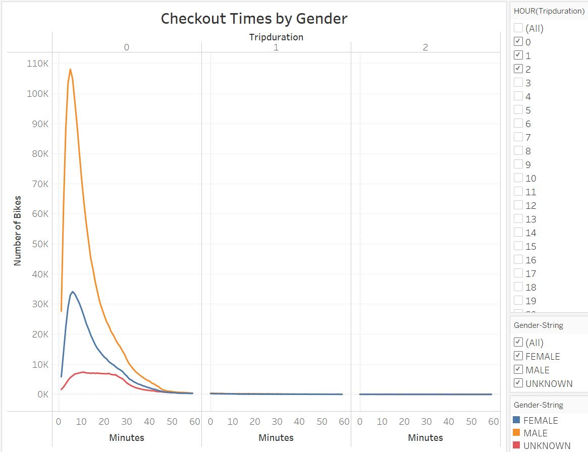

# New York City Bike Share Analysis

## Overview:
Using CitiBike ride data from August 2019, we conducted an analysis of the bike-sharing service and summarized our results in this linked [Tableau story (NY CitiBike Analysis)](https://public.tableau.com/app/profile/ying.ko5568/viz/NYC_Citibike_Challenge_16621374036050/NYCitiBikeAnalysis?publish=yes).  

## Results:
We summarized our analysis in the following Tableau story visulation book:

**Most rides lasted less than an hour** 

**There are more male riders** 

**Demands concentrates around "peak" traffic hours** 

**There is also weekend demands** 

**Demands between males and females are similar** 

**Demands are much higher among subscribers** 

**Many rides begin within the city...** 

**...and end within the city** 

## Summary:
From the analysis, we can conclude that the CitiBike service enjoys high demand during weekday rush hours. In addition, there is also good demand during the day on the weekend. 
 

Some further analysis ideas are: 
* Rides by Age & Gender - this can help us project demands based on local population age distribution.

* Starting Station Location in relationship to Ride Duration - this can help us understand factors affecting ridership by location.
